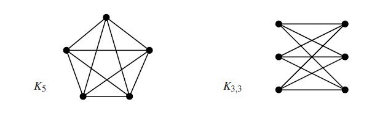

## Graphs and Algorithms

The **degree** of a node is the number of arcs incident on it, where **self-loops** are counted twice


**Definition 1.1.1**:

A **simple graph** is a graph that does not have more than one edge between two vertices and there are no self-loops


**Theorem 1.1.3**:

The number of **odd** nodes in any graph is **even**

Proof:

- We know that the sum of degrees for all nodes must be even (2 times the amount of arcs)
- Suppose there are an odd number of odd nodes, then the $\sum_{nodes} degree = \sum_{nodes_{odd}} degree + \sum_{nodes_{even}} degree$. This number is odd regardless of the amount of even nodes, contradiction


**Definition 1.1.4**:

Let $G = (V,E)$, a graph $G'$ is an **induced subgraph** of $G$ if $nodes(G') \subset nodes(G)$ and $G'$ has all edges of $G$ where both endpoints $\subset nodes(G')$


$G'$ is a **spanning subgraph** of $G$ if $nodes(G') = nodes(G)$ 


**Definition 1.2.1**:

Let $G,G'$ be graphs. An **isomorphism** from $G$ to $G'$ is a bijection $f: nodes(G) \rightarrow nodes(G')$ together with a bijection $g: arcs(G) \rightarrow arcs(G')$ such that $\forall a \in arcs(G)$, if the endpoints of $a$ are $n_1, n_2 \in nodes(G)$, then the endpoints of $g(a)$ are $f(n_1)$ and $f(n_2)$​ 


**Definition 1.2.2**:

Let $G$ be a graph, an **automorphism** on $G$ is an **isomorphism** from $G$ to itself


**Definition 1.2.3**:

A graph is **planar** if its arcs do not cross

If a simple graph is planar, we can always draw the arcs as straight lines that do not cross


**Definition 1.2.5**:

Two graphs are **homeomorphic** if they can be obtained from the same graph by a series of operations replacing an arc $x-y$ by two arcs $x-z-y$ 


**Theorem 1.2.6**:

A graph is planar if and only if it does not contain a sub-graph **homeomorphic** to the two graphs below




**Theorem 1.2.7**:

Leg $G$ be a connected graph. Let $G$ have $N$ nodes, $E$ arcs, and $F$​ Faces, then we have
$$
F = E - N + 2
$$


**Definition 1.2.10**:

A graph $G$ is **bipartite** if $nodes(G)$ can be partitioned into two sets $X$ and $Y$ such that no arcs of $G$ joins any two members of $X$ and $Y$


**Proposition 1.2.11**:

A graph is **bipartite** if and only if it is **2-colourable**


**Theorem 1.2.12**: 

Every map, equivalently every simple planar graph, is **4-colourable**


A path is **simple** if it has no repeated nodes


A **cycle** is a path that finishes where it started, has at least one arc, and **does not use the same arc twice**


An **Euler path** is a path that uses every edge exactly once

An **Euler circuit** is a cycle that uses every edge exactly once


**Theorem 1.3.3**:

A connected graph has an **Euler path** if and only if the number of odd nodes is either 0 or 2. 

A connected graph has an **Euler circuit** if and only if every node has even degree

Proof:

- Suppose that a graph $G$ has an Euler path $P$ starting at node $n_0$ and ending at $n_k$ 
- If $P$ passes through a node $n$, it must enter $n$ as many times as it leaves it
- So if $n$ has odd degree, $P$ can not use all arcs incident on $n$ (there must be 1 left over)
- Hence every node of $P$ must have even degree (except for $n_0$ and $n_k$) 
- And if $n_0 = n_k$, all nodes must have even degree ($P$ now effectively passes through $n_0$, entering it as many times as leaving it)


**Definition 1.3.4**:

A **Hamiltonian path** is a path which visits every node in a graph exactly once

A **Hamiltonian circuit** is a cycle which visits every node exactly once


**Definition 1.4.3**: 

Let $G$ be a graph, a nonrooted tree $T$ is a **spanning tree** for $G$ if $T$ is a subgraph of $G$ and  $nodes(T) = nodes(G)$


**Definition 1.5.3**:

A **directed graph** is **strongly connected** if $\forall x,y \in nodes(G)$ there is a path from $x$ to $y$


**Definition 1.6.2**:

A **weak partial ordering** is a **reflexive, antisymmetric, transitive** binary relation


Given a DAG $G$, let $x \leq y$ if and only there is a path from $x$ to $y$, then $\leq$ is a weak partial ordering

The converse is also true, if $(X, \leq)$ is a partial ordering, let $G$ be the directed graph with nodes $X$ and arcs defined above, then $G$ is acyclic


A topological sort creates a linear sequence of numbers that satisfies the partial ordering


**Correctness of Prim**:

Suppose that Prim is incorrect, which means that an edge that does not belong in the MST is added

**Base Case**: The tree is always correct at first since no edges are added yet

Suppose that an edge $e_1$ connecting two subgraphs is incorrectly added, this means that there must be an edge $e_2$ connecting the same two subgraphs (to ensure that the resultant tree is a spanning tree)

But $weight(e_1) \leq weight(e_2)$ definitely holds since our algorithm chose $e_1$ over $e_2$. Hence $e_1$ is at least as good as $e_2$. Contradiction


**Prim (Code)**:

$\mathcal{O}(N^2)$:

```cpp
vector<pi> adj[maxn];
bool tree[maxn];
bool fringe[maxn];
//parent[i] = the node t in the tree such that (t,i) has the least weight
int parent[maxn];
//Weight function that takes the two endpoint as parameters
int W[maxn][maxn];
//weight[i] = the minimum weight from a node in the tree to i
int weight[maxn];

void prim(int start){
    tree[start] = true;
    for(pi x : adj[start]){
        //Add x to fringe
        fringe[x.fi] = true;
        parent[x] = start;
        weight[x] = W[start][x];
    }
    for(int i = 1; i < N; ++i){
        int f; //next node
        int w = INF; //weight
        for(int j = 1; j <= N; ++j){
            if(fringe[j] && W[parent[j]][j] < w){
                w = W[parent[j]][j];
                f = j;
            }
        }
        //Add f into the tree
        fringe[f] = false;
        tree[f] = true;
        for(pi x : adj[f]){
            if(!tree[x]){
                if(fringe[x]){
                    if(W[f][x] < weight[x]){
                        weight[x] = W[f][x];
                        parent[x] = f;
                    }
                }
                else{
                    fringe[x] = true;
                    weight[x] = W[f][x];
                    parent[x] = f;
                }
            }
        }
    }
}
```


$\mathcal{O}(NlogN)$:

```cpp
priority_queue<int,vector<int>,cmp> Q;
//key[i] = min distance from i to any node in the MST
int key[maxn]; 
bool tree[maxn];
vector<int> adj[maxn];
//Weight function that takes the two endpoint as parameters
int W[maxn][maxn];

bool cmp(int a, int b){
    return key[a] < key[b];
}

void prim(int start){
    for(int i = 1; i <= N; ++i)Q.push(i);
    key[start] = 0;
    while(!Q.empty()){
        f = Q.top(); Q.pop();
        tree[f] = true;
        for(int x : adj[f]){
            if(!tree[x]){
                if(W[f][x] < key[x]){
                    key[x] = W[f][x];
                }
            }
        }
    }
}
```


**Correctness of Kruskal**:

Suppose that an incorrect edge is added by the Kruskal algorithm

**Base Case**: We start with a tree with no edges so nothing can go wrong

Suppose that the result after $k$ steps (denoted as $F_k$) is correct (it is a subgraph of a possible MST) and the new edge $a_{k+1} \not\in arcs(T')$ ,  where $T'$ is any MST

Suppose that $a_{k+1}$ joins $x,y$. There must be an path $P$ in $T'$ such that $P \bigcup a_{k+1}$ forms a cycle as $T'$ is a MST

We also know that there must be an edge in $P$ not in $F_k$ or $a_{k+1}$ would not have been added otherwise. 

Suppose this edge $b$ joins $x', y'$. There must not be a path from $x'$ to $y'$ in $F_k$ or else there would be a cycle in $T'$ as $F_k$ is a subgraph of $T_k$ . Hence $b$ is also a candidate edge to add to $F_k$

But Kruskal chose $a_{k+1}$ over $b$, implying that $a_{k+1}$ has a smaller weight, we can remove $b$ and add $a_{k+1}$ to $T'$ to form a new spanning tree with smaller weight. Contradiction with the fact that $T'$ is a MST.

Hence Kruskal must be right


**Kruskal (Code)**:

$\mathcal{O}(NlogN)$ :

```cpp
edge adj[maxm];
int fa[maxn];

int find(int x){
    return (x == fa[x])?fa[x]:(fa[x] = find(fa[x]));
}

void merge(int x, int y){
    int fx = find(x), fy = find(y);
    fa[fx] = fy;
}

int kruskal(){
    sort(adj+1,adj+m+1); //sort edges by weight
    int cnt = 0,id=0,weight=0;
    for(int i = 1; i <= N; ++i)fa[i] = i;
    while(cnt <= N-1){
        ++id;
        int a = adj[id].from, b = adj[id].to;
        if(find[a] == find[b])continue;
        ++cnt;
        merge(a,b);
        weight += adj[id].weight;
    }
    return weight;
}
```


**Dijkstra (Idea)**:

Kind of like Prim's for MST

1. Set $dist[start] = 0$ and the rest to infinity
2. Pop from the queue, call that node $x$
3. Add nodes adjacent to $x$ into the set of fringe nodes
4. Update distances of nodes adjacent to $x$ 
5. Repeat steps 2-4 for the whole tree, then return $dist[finish]$ 


**Dijkstra (Code)**:

$\mathcal{O}(N^2)$ :

```cpp
bool tree[maxn];
bool fringe[maxn];
int dist[maxn];
vector<pi> adj[maxn];

void dijk(int start){
    memset(dist,0x3f,sizeof(dist));
    tree[start] = true;
    for(x : adj[start]){
        fringe[x.fi] = true;
        distance[x.fi] = x.se;
    }
    while(true){
        //Exit algorithm if fringe is empty
        bool flag = true;
        for(int i = 1; i <= N; ++i)if(!fringe[i])flag = false;
        if(flag)return;
        //Select fringe node with dist[f] minimum
        int f; int v = 0x3f3f3f3f;
        for(int i = 1; i <= N; ++i){
            if(fringe[i] && dist[i] < v){
                v = dist[i];
                f = i;
            }
        }
		fringe[f] = false;
        tree[f] = true;
        for(pi x : adj[f]){
            if(tree[x.fi])continue;
            if(fringe[x.fi]){
                distance[x.fi] = min(distance[x.fi], distance[f] + x.se);
            }
            else{
                fringe[x.fi] = true;
                distance[x.fi] = distance[f] + x.se;
            }
        }
    }
}
```


$\mathcal{O}(N logN)$: 

```cpp
priority_queue<int,vector<int>,cmp> Q;
//dist[i] = min distance from i to any node in the MST
int dist[maxn]; 
bool tree[maxn];
vector<pi> adj[maxn];

bool cmp(int a, int b){
    return dist[a] < dist[b];
}

void dijk(int start){
    memset(dist,0x3f,sizeof(dist));
    for(int i = 1; i <= N; ++i)Q.push(i);
    dist[start] = 0;
    while(!Q.empty()){
        int f = Q.top(); Q.pop();
        tree[f] = true;
        for(pi x : adj[f]){
            if(!tree[x.fi]){
                dist[x.fi] = min(dist[x.fi], dist[f] + x.se);
            }
        }
    }
}
```


**A* Algorithm (Idea)**:

Suppose we have a **heuristic function** $h(x)$ that **underestimates** the distance from any node $x$ to the finish node


A heuristic function is **consistent** if

- $\forall$ adjacent nodes $x,y$, we have $h(x) \leq W(x,y) + h(y)$ 
- $h(finish) = 0$ 


A heuristic function is **admissible** if $\forall x$ we have $h(x) \leq$ the shortest path from $x$ to finish


Whereas Dijkstra uses the distance from the start node to the current node as the comparator to sort nodes (denoted as $g(x)$ , A* uses $f(x)$ as the comparator, where $f(x) = g(x) + h(x)$ 


**A* Algorithm (Code)**:

$\mathcal{O}(N logN)$:

```cpp
bool tree[maxn];
int g[maxn];
int h[maxn];
priority_queue<int,vector<int>,cmp> Q;
vector<pi> adj[maxn];

bool cmp(int a, int b){
    return g[a] + h[a] < g[b] + h[b];
}

void A*(int start){
    memset(g,0x3f,sizeof(g));
    for(int i = 1; i <= N; ++i)Q.push(i);
    g[start] = 0;
    while(!Q.empty()){
        int x = Q.top(); Q.pop();
        tree[x] = true;
        for(pi y : adj[x]){
            if(tree[y.fi])continue;
            g[y] = min(g[y], g[x] + y.se);
        }
    }
}
```


**Definition 1.7.14**:

Let $R \subset X^2$ be a binary relation

The **transitive closure** of $R$ (denoted as $R^+$) is the smallest relation $S \subset X^2$ such that $R \subset S$ and $S$ is transitive 

- Alternatively, the transitive closure of $R$ is also the intersection of all transitive relations on $X^2$ that includes $R$ as a subset

$R$ is transitive is equivalent to $R \circ R \subset R$ 

Using this definition, we get that
$$
R^+ = \bigcup_{k=1}^\infin R^k
$$
If $X$ is finite with cardinality $n$ , then 
$$
R^+ = \bigcup_{k=1}^n R_k
$$


**Floyd-Warshall (Idea)**:

Suppose that we have nodes $\{1, \cdots n\}$, consider a path $p = x_1, x_2, \cdots, x_k$ from $x_1$ to $x_k$. Define the nodes $x_2, \cdots ,x_{k-1}$ as the **intermediate nodes** of $p$

Let $B_k[i ][j]$ be the shortest path from $i$ to $j$ that only uses nodes with $id \leq k$ as intermediate nodes. Clearly $B_0$ can be initialized using the given adjacency list (define $B_o[i][j] = \infin$ if there is no edge directly connecting $i,j$)

To calculate $B_k[i][j]$ from $B_{k-1}[i][j]$, there are two cases:

- if we are not using node $k$, $B_k[i][j] = B_{k-1}[i][j]$ 
- if we are using node $k$, $B_k[i][j] = B_{k-1}[i][k] + B_{k-1}[k][j]$ 

$B_n[i][j]$ is the answer


**Floyd-Warshall (Code)**:

```c++
int f[2][maxN][maxN];
int adj[maxN][maxN];
void warshall(){
    memset(f[0],0x3f,sizeof(f[0]));
    for(int i = 1; i <= N; ++i){
        for(int j = 1; j <= N; ++j){
            f[0][i][j] = adj[i][j];
        }
    }
    for(int k = 1; k <= N; ++k){
        swap(f[0],f[1]);
        for(int i = 1; i <= N; ++i){
            for(int j = 1; j <= N; ++j){
                f[0][i][j] = min(f[1][i][j],f[1][i][k] + f[1][k][j]);
            }
        }
    }
}
```


**Traveling Salesman Problem**:

Given a **complete** weighted graph, find the minimum distance needed to visit each node exactly once


**Bellman-Held-Karp algorithm (Idea)**:

WLOG, start the tour at $x = 1$ 

Define $C(S,x)$ to be the minimum cost of a path from node 1 to $x$ using precisely the set of intermediate nodes $S$ 

The solution is then
$$
min_{x \neq 1} C(Nodes \backslash \{1,x\},x) + W(x,1)
$$
We calculate $C(S,x)$ in increasing size order

Clearly $C(\empty, x) = W(1,x)$ 

$C(S,x)$ can be calculate by:
$$
C(S,x) = min_{y \in S} C(s \backslash y ,y) + W(y,x)
$$
Complexity: $\mathcal{O}(N^22^N)$ 


**Definition 2.4.1 (Order of Complexity)**:

Let $f,g: \mathbb{N} \rightarrow \mathbb{R}^+$ : 

- $f$ is $O(g)$ if and only if $\exist m \in \mathbb{N}, c \in \mathbb{R}^+$ such that $\forall n \geq m, f(n) \leq c \cdot g(n)$ 
- $f$ is $\mathcal{O}(g)$ if and only if $f$ is $O(g)$ and $g$ is $O(f)$ 


**Strassen's Algorithm**:

Assume that we are multiplying 2 $n \times n$ matrices. First consider $n = 2$ ($AB=C$)
$$
C = \begin{bmatrix} a_{11}b_{11} + a_{12}b_{21} && a_{11}b_{12} + a_{12}b_{22} \\ a_{21}b_{11} + a_{22}b_{21} && a_{21}b_{12} + a_{22}b_{22} \end{bmatrix}
$$
But we can get the equivalent expression by writing
$$
C = \begin{bmatrix} x_1+x_4-x_5+x_7 && x_3+x_5 \\ x_2+x_4 && x_1+x_3-x_2+x_6 \end{bmatrix}
$$
where

- $x_1 = (a_{11} + a_{22}) * (b_{11} + b_{22})$ 
- $x_2 = (a_{21} + a_{22}) * b_{11}$ 
- $x_3 = a_{11} * (b_{12}-b_{22})$
- $x_4 = a_{22} * (b_{21} - b_{11})$
- $x_5 = (a_{11} + a_{12}) * b_{22}$ 
- $x_6 = (a_{21}-a_{11}) * (b_{11} + b_{12})$
- $x_7 = (a_{12}-a_{22}) * (b_{21} + b_{22})$ 


In the former case, 8 multiplications and 4 additions were used

In the latter case, 7 multiplications and 18 additions were used


Now consider $n = 2^k, k \in \mathbb{Z}$ , divide the matrices into four quadrants, each $\frac{n}{2} \times \frac{n}{2}$ . Compute the product recursively


The number of arithmetic operations $A(k)$ for $n = 2^k$ is given by the recurrence relation
$$
A(0) = 1
$$

$$
A(k) = 7A(k-1) + 18(\frac{n}{2})^2
$$

By repeated expansion an summing geometric sequences, $A(k) \approx 7n^{2.807} - 6n^2$ 


**Lower bound for sorting by comparison**:

Any algorithm for sorting by comparison can be expressed as a decision tree, where each non-leaf node has a pair of indices $i,j < n$. The left-side path is traversed if $arr[i] \leq arr[j]$, the right-side path is traversed if $arr[i] > arr[j]$ 

Every leaf node represents a possible outcome by a permutation of $[0, 1, \cdots, n-1]$. Trivially, there are $n!$ leaf nodes

The worst number of comparisons needed is equal to the depth of this binary search tree. Since we know that if a binary tree has depth $d$, then it has $\leq 2^d$ leaves
$$
n! \leq 2^d
$$

$$
d \geq log(n!)
$$

Stirling's formula gives
$$
ln(n!) = nlnn - n + \mathcal{O}(ln n)
$$
Hence we have,
$$
d \geq \mathcal{O}(NlogN)
$$


**Definition 2.6.5**:

A binary tree of depth $d$ is **balanced** if every leaf node is of depth $d$ or $d-1$ 


**Proposition 2.6.6**:

If a binary tree is unbalanced then we can find a balanced tree with the same number of leaves without increasing the total path length

Given an unbalanced tree, there must be a leaf of depth $d$ and a leaf of depth $d' \leq d-2$ by definition. Take a node of depth $d$, there are two cases:

- If the node has no siblings (its parent does not have other children), then remove it. The total path length is reduced by 1 in this case
- If the node has siblings, first remove it, then add two leaves to the node of depth $d'$. In this case, the old two leaves contribute $d + d'$ to the total path length, whereas the new two leaves contribute $2(d'+1)$ to the total path length. $2(d' + 1) \leq d + d'$ given that $d' \leq d - 2$

The number of leaves does not change and the total path length does not increase in both cases. We can repeat the above action until the tree is balanced


**Lower bound for sorting in average case**:

Since we can make any tree balanced, we can only consider balanced trees. For balanced trees the average depth of leaf nodes must be between $d-1$ and $d$. As the tree has a depth of $log(n!)$, the lower bound for the average case is $\mathcal{O}(NlogN)$ 


**Corollary 2.6.9**:

Let $t(n)$ be the largest term in the geometric progression 
$$
a,ar,ar^2, \cdots, ar^k
$$
then
$$
\sum_{i=0}^k ar^i = \mathcal{O}(t(n))
$$


**Master Theorem**:

Used to solve relations like the following:
$$
T(n) = aT(\frac{n}{b}) + f(n)
$$
The recursion tree will have $1 + log_b^n$ levels:

- Level 0: $f(n)$
- Level 1: $af(\frac{n}{b})$ 
- Level 2: $a^2f(\frac{n}{b^2})$ 
- Level $log_b^n$: $\mathcal{O}(a^{log_b^n})$ 

The total work needed is $\sum_{k=0}^{log_b^n} a^kf(\frac{n}{b^k})$ 

Suppose that $f(n) = n^c$, then the above formula can be converted to
$$
= \sum_{k=0}^{log_b^n} a^k(\frac{n}{b^k})^c = \sum_{k=0}^{log_b^n} (\frac{a}{b^c})^kn^c
$$
The ratio of the geometric series $r = \frac{a}{b^c}$

Define the **critical exponent** to be 
$$
E = \log_b^a = \frac{\log a}{\log b}
$$
Then $r > 1$ if and only if $E >c$ (algebraic manipulation)

By **Corollary 2.6.9**, there are three cases to the sum above:

- $E < c: T(n) = \mathcal{O}(f(n))$
- $E = c: T(n) = \mathcal{O}(f(n)k) = \mathcal{O }(f(n) \log n)$ 
- $E > c: T(n) = \mathcal{O}(a^{\log_b^n}) = \mathcal{O}(n^{\log_b^a}) = \mathcal{O}(n^E)$ 


**Quick Sort (Idea)**:

Choose an element (pivot), put all elements less than the pivot to the left of the pivot and elements greater than the pivot to the right of the pivot

Now the pivot is in the correct position. Recursively sort the left sublist and the right sublist


**Quick Sort (Complexity)**:

We get the following recurrent relation:

- $A(0) = A(1) = 0$
- $A(n) = n - 1 + \frac{1}{n} \sum_{s=0}^{n-1} (A(s) + A(n-s-1))$

The list may be split at any index


The above can be simplified to:

- $A(0) = A(1) = 0$
- $A(n) = n - 1 + \frac{2}{n} \sum_{i=2}^{n-1} A(i)$


We can show $A(n) \leq 2n \ln n$ by strong induction, the hypothesis holds for $n=1$. Now we assume that $\forall i < n, A(i) \leq 2i \ln i$ 
$$
A(n) = n-1 + \frac{2}{n} \sum_{i=2}^{n-1} A(i) \leq n + \frac{2}{n}\sum_{i=2}^{n-1}2i\ln i = n + \frac{2}{n}\int_2^n 2x \ln xdx 
$$

$$
= n + \frac{2}{n}[x^2(\ln x - \frac{1}{2})]_2^n = 2n \ln n - \frac{8 \ln 2 - 4}{n} \leq 2n \ln n
$$

Since $\forall n, A(n) \leq 2n \ln n$, $A(n)$ is of order $\mathcal{O}(N \log N)$ 


**Quick Sort (Implementation)**:

```c++
int arr[maxN];

void quickSort(int l, int r){
    if(l >= r)return;
    int i = l, j = r;
    int pivot = arr[l];
    while(i < j){
        //Find the first number < pivot from the right
        while(arr[j] >= pivot && i < j)--j;
        //Find the first number > pivot from the left
        while(arr[i] <= pivot && i < j)++i;
        if(i < j)swap(arr[i],arr[j]);
    }
    //Put pivot in the right place
    swap(arr[l],arr[i]);
    //Recursion
    quickSort(l,i-1);
    quickSort(i+1,r);
}
```


**Heapsort (Idea)**:

A **heap** is a **left-complete** binary tree. This means that if the tree has depth $d$, then

- all nodes are present at depth $0,1, \cdots , d-1$ 
- At depth $d$ no node is missing to the left of a node that is present


We say that a tree $T$ is a **minimising partial order tree** if the key at any node $\leq$ the keys at its child nodes

- The **maximising partial order tree** is defined in a similar way


A **min heap** is defined to be a **heap** with the **minimising partial order tree property**

- A **max heap** is defined in a similar way


Heap sort first builds a max heap, then repeatedly removes the top element and add it to the sorted array starting at the right hand end. After each removal, calculations are performed to make sure that the remaining data structure is still a heap


Remark: Priority Queues are usually implemented using binary heaps


**Heap sort (Implementation)**:

```cpp
int arr[maxn];
int sorted[maxn];

//This operation does atmost 2 * depth of heap operations
//Depth = log N, hence this function has O(log N) complexity
void fixMaxHeap(node H){
    if (!isLeaf[H]){
        largerSubHeap = max(leftChild, rightChild);
    }
    if(H.key < largerSubHeap.key){
        swap(H.key,largerSubHeap.key);
        fixMaxHeap(largerSubHeap);
    }
}

//Recurrence relation: W(n) = 2W((n-1)/2) + 2log n
//Apply the Master Theorem with a = 2, b = 2, f(n) = 2log n
//Critical exponent E = 1, E > c, W(n) = O(n^E) = O(n)
void buildMaxHeap(node H){
    if(!isLeaf[H]){
       buildMaxHeap(H.leftChild);
       buildMaxHeap(H.rightChild);
       fixMaxHeap(H);
    }
}

void deleteRoot(){
    //Copy the last element (right most element in the last layer) into the root
    //Remove that element
    fixMaxHeap(H); //O(logN)
}

void heapsort(){
    buildMaxHeap(); //O(N)
    for(int i = n; i >= 1; --i){
        int max = getMax(); //Get root of heap
        deleteRoot(); //Delete root of heap O(logN)
        sorted[i] = max;
    }
}
//Hence we have a total complexity of O(NlogN)
```


**Introduction to Complexity**:

**Decision Problems** are problems with a yes or no answer

A **decision problem** is in the **complexity class $P$** if it can be decided within polynomial time


**Proposition 3.1.10**:

Suppose that $f,g$ are $p$-time computable functions, the composition $g \circ f$ is also $p$-time computable


**Definition 3.2.1**:

A decision problem $D(x)$ is **NP (non-deterministic polynomial time)** if there is $p$-time computable problem $E(x,y)$ and a polynomial $p(n)$ such that

- $D(x) \leftrightarrow \exist y, E(x,y)$ 
- if $E(x,y)$ then $\abs{y} \leq p(\abs{x})$ 

Basically this type of problems can be efficiently verified in polynomial time but not solved in $p$-time 


**Proposition 3.2.3**:

If a decision problem is in $P$, the it is in $NP$

Proof:

- We define $E(x,y)$ such that $E(x,y) \leftrightarrow D(x) \bigwedge y = 0$ ($y= 0$ is just a random guess)
- Then we have $D(x) \leftrightarrow \exist y, E(x,y)$ 

Basically instead of guessing we just directly calculate the answer and verify it to satisfy the $NP$ conditions


**Definitions**:

We define $D$ **reduces** to $D'$(Notation: $D \leq D'$) if there is a $p$-time computable function $f$ such that
$$
D(x) \leftrightarrow D'(f(x))
$$

Application:

- The idea is that we reduce from an easier problem $D$ to a more difficult problem $D'$
- Suppose that we have an algorithm $A'$ which decides $D'$ in $p'(n)$, then if $D \leq D'$ via reduction function $f$ in $p(n)$ time. we have an algorithm $A$ to decide $D$:
- Algorithm $A$ (input $x$):
  - Compute $f(x)$
  - Run $A'$ on $f'(x)$ and return the answer

Note: 

- The reduction order is reflexive and transitive
- If both $D \leq D'$ and $D' \leq D$, we write $D \sim D'$ , which means that they are as hard as each other


**Proposition 3.3.1**:

Suppose $D \leq D'$ and $D' \in P$, then $D \in P$ 


**Proposition 3.3.2**:

Suppose $D \leq D'$ and $D' \in NP$, then $D \in NP$ 

Proof:

- Assume that $D \leq D'$ via reduction function $f$, and $D' \in NP$ 
- This means that there is a $E'(x,y) \in P$ and a polynomial $p'(n)$ such that $D'(x) \leftrightarrow \exist y, E'(x,y)$ and if $E'(x,y)$ then $\abs{y} \leq p'(\abs{x})$ 
- Also we have $D(x) \leftrightarrow D'(f(x))$
- Hence $D(x) \leftrightarrow \exist y, E'(f(x),y)$ 
- Define $E(x,y) \leftrightarrow E'(f(x),y)$, then $D(x) \leftrightarrow \exist y, E(x,y)$. Also $E \in P$ since that $E(x,y) \leftrightarrow E'(f(x),y) \leq p'(\abs{f(x)})$ 


**Definition 3.4.1**: 

A decision problem $D$ is $NP$-hard if $\forall D' \in NP$, $D' \leq D$ 


**Definition 3.4.2**

A decision problem $D$ is $NP$-complete ($NPC$) if

- $D \in NP$ 
- $D$ is $NP$-hard


**Theorem 3.4.3**:

SAT is $NPC$ 


**Method 3.4.4**:

To show that problem $D$ is $NPC$, instead of proving it directly from the definition, we show it by proving:

- $D \in NP$
- $D' \leq D$ for some known $NPC$ problem $D'$ 


**Proposition 3.4.5**:

Suppose $P \neq NP$, if a problem $D$ is $NP$-hard then $D \not\in P$ 

Proof:

- Assume $P \neq NP$ and $D$ is $NP$-hard
- Suppose for a contradiction that $D \in P$, take $D' \in NP$, since $D$ is $NP$-hard, we have $D' \leq D$, $D' \in P$. We now have $P = NP$, contradiction


